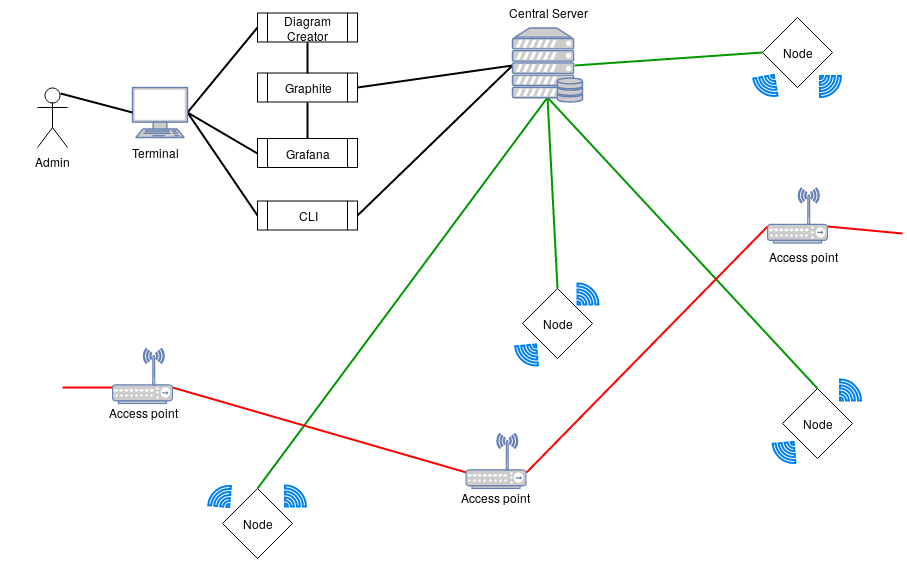

# Functional Specification
## Distributed WiFi Monitoring

## Table of contents

1. [Introduction](##\ 1.\ Introduction)
    - 1.1 [Overview](###\ 1.1\ Overview)
    - 1.2 [Glossary](###\ 1.2\ Glossary) 
2. [General Description](##\ 2\ General\ Description)
    - 2.1 [Product / System Functionalities](###\ Product\ \/\ System\ Functionalities)
    - 2.2 [User Characteristics and Objectives](User\ Characteristics\ and\ Objectives)
    - 2.3 [Operational Scenarios](###Operational\ Scenarios)
    - 2.5 [Use Cases](###\ Use\ Cases)
    - 2.6 [Constraints](###\ Constraints)
3. [Functional Requirements](##Functional\ Requirements)
4. [System Architecture](##System\ Architecture)
5. [High-Level Design](##High-Level\ Design)
6. [Preliminary Schedule](##Preliminary\ Schedule)
7. [Appendices](##Appendices)

## 1. Introduction

### 1.1 Overview:

The product we are developing is a product to make it easier for admins to detect malicious activity and wifi performance throughout the system. We are doing this by placing raspberry pis or nodes strategically around the campus, business or organization. The Raspberry Pis will be running kali linux which is a distribution specifically for network penetration and testing. On Kali linux we are using scapy with python to run scripts to sniff packets and create packets to test our snort rules. The scripts will be collecting and logging critical information about the wireless network to be received by the server where they will be graphed and processed. Snort is a network intrusion detection system (NIDS) that will be used as a filter for the packets. We will be filtering the packets by creating rules for what we want to filter and detect. Snort can be used to send alerts when the filters catch unusual traffic which does not match the usual network activity. With all of the information collected from the python scripts and snort, we will be displaying the information using graphite and grafana. This will display and accurate representation of the state of their system to the client/admin on the other end. This will also have the ability to display historical statistics providing that the system was running and listening at the time.


### 1.2 Glossary:

* **Kali Linux**: 
    * Linux distribution targeted towards offensive security and penetration testing
* **Raspberry Pis**: 
    * Small cheap computers with bluetooth and wifi built in
* **Grafana**: 
    * Web front or displaying graphs and querying metrics from graphite
* **Graphite**: 
    * Backend for Grafana collects data and metrics. 
* **NIDS**: 
    * Network intrusion detection system looks at packets on the network and will detect and alert known patterns in these packets as malicious activity
* **CLI**: 
    * Command Line Interface

## 2 General Description

### 2.1 Product / System Functions:

The function of this product is to be able to detect malicious activity while, also, accurately displaying information and metrics related to the wireless network to the admin or client. This information will include details of any ongoing problems with the Wifi signal throughout the organisation, and also screening for any abnormalities and malware on the network.


### 2.2 User Characteristics and Objectives:

We expect our users to be very well adapted to technology, as we expect that most of our user base will be admins. From the user's perspective the software should detect and give alerts of malicious or unusual activity within the network with minimal configuration needed day to day. Most of the interaction will be querying and browsing graphs through grafana and graphite or querying a command line interface(CLI)

### 2.3 Operating Environment

The operating evironment will be a striped down version of kali linux designed for the raspberry pi. This will allow us to have the ensential tools for penetration testing while also being light weight enough to run on raspberry pis. The server will be an Ubuntu system running graphite and grafana to collect and graph metrics with apache to manage the web hosting. 

### 2.4 Operational Scenarios:

#### User Mike Logs onto grafana

* Current System State: Server is collecting metrics and graphite collecting
* Informal Scenario: User Mike enters the username and password and is granted access to all the statistics being collected by the system.
* Next Scenario: User Mike wants to make new graph

#### User Mike Logs wants to make a new graph
* Current System State: User Mike is logged in
* Informal Scenario: User Mike adds a new panel and creates graphite query
* Next Scenario: User Mike creates an alert for the newly created graph

#### User Mike makes an alert
* Current System State: User Mike has made a graph
* Informal Scenario: User Mike clicks on the alert tab and enters the value at which he wants an alert to go to him and how he wants that alert be received
* Next Scenario: User Mike wants to make new alert to detect ARP poisoning

#### User Mike checks for ARP poisoning
* Current System State: User Mike is logged in and has made graphs
* Informal Scenario: User Mike queries the graphite database to see if there are any devices that are suspected to be performing ARP poisoning and sets up an alert in the alert tab.
* Next Scenario: User Mike hears a report the wifi has been bad in an area 

#### User Mike checks wifi in an area
* Current System State: Mike is logged on
* Informal Scenario: Mike finds the node in that area and looks at the graph. He sees that the connection to the access point does not drop but there are too many packets for the access point to handle causing a bottleneck.
* Next Scenario: Mike wants to view the throughput of an access point

#### Mike wants to check throughput of access point
* Current System State: Mike is logged on
* Informal Scenario: Mike goes to the node that is near the access point. He queries the graphite database to see what the throughput is throughout the day
* Next Scenario: Mike wants to find what node can see an access point with a known mac address

#### Mike wants to know who can see a certain access point
* Current System State: Mike logs onto the CLI
* Informal Scenario: Mike queries the system with the mac address of the access point and it return what node(s) can see it
* Next Scenario: Mike logs onto grafana

#### Mike wants to turn off certain rules
* Current System State: Mike logs into command line interface
* Informal Scenario: Mike edits a configuration and makes the value for the rule false 
* Next Scenario: Mike logs into grafana to check

### 2.5 Use Cases

| Use Case 1             | User logs into grafana                                        |
| ------------------------|:----------------------------------------------------------:|
| **Goal in Context**         | User is granted access to grafana                     |
| **Scope & Level**           | System                                              |
| **Preconditions**           | Grafana must be running and a user account hs to be created      |
| **Success End Condition**   | User gains access to grafana |
| **Failed End Condition**    | User is denied access because username or password were not correct |
| **Primary Actors,<br>Secondary Actors**         | User,<br> Grafana               |
| **Trigger**                 | User clicks login |
|**DESCRIPTION**
| **Step** | **Action**                                               |
| 1        | User logs in to grafana with username and password       |
| 2        | Grafana grants access to home      |
|**EXTENSIONS**
| **Step** | **Branching Action**                                     |
| 3a       | Grafana denies access to user       |


| Use Case 2             | User wants to make a graph                                   |
| -------------------------|:---------------------------------------------------------:|
| **Goal in Context**         | User wants to make a grafana graph                    |
| **Scope & Level**           | Grafana                               |
| **Preconditions**           | Grafana must be running and a user account has been created, and grafana is collecting metrics   |
| **Success End Condition**   | Grafana is displaying accurate graphs |
| **Failed End Condition**    | Grafana is not displaing or metrics are inaccurate |
| **Primary Actors,<br>Secondary Actors**         | User,<br> Grafana, Graphite               |
| **Trigger**                 | User clicks away from query |
|**DESCRIPTION**
| **Step** | **Action**                                               |
| 1        | User logs in to grafana with username and password       |
| 2        | User enters graphite query in grafana query box      |
| 3        | Grafana shows a graph for all metrics in the time period selected, in grafana   |
|**EXTENSIONS**
| **Step** | **Branching Action**                                     |
| 3a       | Grafana reports an error in the query       |


| Use Case 3             | User wants to make an alert                                  |
| -----------------------|:---------------------------------------------------------:|
| **Goal in Context**         | User wants to make an alert                    |
| **Scope & Level**           | Grafana                            |
| **Preconditions**           | Grafana must be running and a user account has been created, and grafana is collecting metrics                |
| **Success End Condition**   | Grafana alerts to abnormal activity for snort rules |
| **Failed End Condition**    | Grafana does not alerts to malicious activity |
| **Primary Actors,<br>Secondary Actors**         | User,<br> Grafana, Graphite               |
| **Trigger**                 | Malware is detected |
|**DESCRIPTION**
| **Step** | **Action**                                               |
| 1        | User logs in to grafana with username and password       |
| 2        | User enters graphite query in grafana query box      |
| 3        | Grafana shows a graph for all metrics in the time period selected, in grafana   |
| 4        | Grapfana alerts to an abnormality in the graph that corresponds to proable malware |
|**EXTENSIONS**
| **Step** | **Branching Action**                                     |
| 3a       | Grafana does not alert to malware happening on the wifi     |

| Use Case 4             | User wants to check for ARP posioning                 |
| -----------------------|:---------------------------------------------------------:|
| **Goal in Context**         | User wants to read the graphs to see if there has been suspected arp posioning attemps and how often|
| **Scope & Level**           | Grafana                            |
| **Preconditions**           | Grafana must be running and a user account has been created, and grafana is collecting metrics     |
| **Success End Condition**   | Grafana produces graphs from the time period selected |
| **Failed End Condition**    | Grafana does not have metrics for that time period |
| **Primary Actors,<br>Secondary Actors**         | User,<br> Grafana, Graphite               |
| **Trigger**                 | User clicks graph |
|**DESCRIPTION**
| **Step** | **Action**                                               |
| 1        | User logs in to grafana with username and password       |
| 2        | User enters graphite query in grafana query box      |
| 3        | Grafana shows a graph for all metrics in the time period selected, in grafana   |
| 4        | Grapfana shows grpah with all the data requested and time period requested | 
|**EXTENSIONS**
| **Step** | **Branching Action**                                     |
| 3a       | Grafana does not have any metrics for this time period  |

| Use Case 5             | User wants to check throughput of access point |
| -----------------------|:---------------------------------------------------------:|
| **Goal in Context**         | User wants to read the graphs to see how much throughput an access point has thouoghout a day|
| **Scope & Level**           | Grafana                            |
| **Preconditions**           | Grafana must be running and a user account has been created, and grafana is collecting metrics     |
| **Success End Condition**   | Grafana produces graphs from the time period selected |
| **Failed End Condition**    | Grafana does not have metrics for that time period |
| **Primary Actors,<br>Secondary Actors**         | User,<br> Grafana, Graphite, Throughput Daemon               |
| **Trigger**                 | User clicks graph |
|**DESCRIPTION**
| **Step** | **Action**                                               |
| 1        | User logs in to grafana with username and password       |
| 2        | User enters graphite query in grafana query box      |
| 3        | Grafana shows a graph for all metrics in the time period selected, in grafana   |
| 4        | Grapfana shows graph with all the throughput data requested and time period requested | 
|**EXTENSIONS**
| **Step** | **Branching Action**                                     |
| 3a       | Grafana does not have any metrics for this time period  |
| 3b       | Grafana shows low throughput for this time period  |

| Use Case 6             | User wants to check how many access points each access point can see|
| -----------------------|:---------------------------------------------------------:|
| **Goal in Context**         | User wants to be able to see what |
| **Scope & Level**           | Grafana                            |
| **Preconditions**           | Grafana must be running and a user account has been created, and grafana is collecting metrics     |
| **Success End Condition**   | Grafana produces graphs from the time period selected |
| **Failed End Condition**    | Grafana does not have metrics for that time period |
| **Primary Actors,<br>Secondary Actors**         | User,<br> Grafana, Graphite, Throughput Daemon               |
| **Trigger**                 | User clicks graph |
|**DESCRIPTION**
| **Step** | **Action**                                               |
| 1        | User logs in to grafana with username and password       |
| 2        | User enters graphite query in grafana query box      |
| 3        | Grafana shows a graph for all metrics in the time period selected, in grafana   |
| 4        | Grapfana shows graph with all the number of access points each node can see | 
|**EXTENSIONS**
| **Step** | **Branching Action**                                     |
| 3a       | Grafana does not have any metrics for this time period  |

### 2.6 User Documentation

* Grafana  - Has documentation
* Graphite - Has documentation
* Kali     - Has documentation
* Snort    - Has documentation but limited, suplement documentation and configuration needs to be done
* Daemons  - Has to be fully documented by us

### 2.7 Assumptions and Dependencies

* We are assuming our end user will be admins and of substatial knowledge configuring a network

## 3. Functional Requirements

### Node Automatic Connection To Server

* Description - The node once deployed and turned on with a fully configured system should be able to look and find the server automatically, and headlessly
* Criticality - This is most critical. Without connecting to server we have no way to collect metrics
* Technical issues - Figuring out how allow a node to automatically find the server
* Dependencies with other requirements - None

### Network Metric Collection

* Description - The system should collect metrics about wireless networks around it.
* Criticality - This is most critical. Everything relies on this.
* Technical issues - Figuring out how to collect these metrics fast and reliably
* Dependencies with other requirements - None

### Network Reliability Collection

* Description - The system should collect metrics about how reliable the system has been in previous history
* Criticality - This is critical. We want to see at what time the network is failing and how often
* Technical issues - Figuring out how to collect these metrics fast and reliably and on a possibly failing wifi network
* Dependencies with other requirements - None

### Alert System

* Description - The system needs to be able to alert to errors, and malicious activity
* Criticality - This is critical. Without this, many abnormalities may go unseen to admins
* Technical issues - Figuring out what to page for and what to log for. Also are there different ways to alert, emails for less important, slack message for urgent
* Dependencies with other requirements - Metrics being collected

### Local SSID Collection
* Description - The system should log all ssids that is sees and check that there mac address is known
* Criticality - This is critical. This needs to be alerted to
* Technical issues - Figuring out how to collect these metrics fast and reliably
* Dependencies with other requirements - Depends on network to be functional

### Network DCHP Server Collection
* Description - The system should collect metrics about all DCHP servers and ensure that they are belonging to the organisation and not a spoof
* Criticality - This is critical. This needs to be alerted to
* Technical issues - Figuring out how to collect these metrics fast and reliably
* Dependencies with other requirements - Depends on alerts to be operational

### Node Up Check
* Description - We need to monitor what nodes are up and what nodes have gone down
* Criticality - This is important. This is crutical to detecting broken areas of a network
* Technical issues - Figuring out how to create our own tcp ping packet, that will let the server and the node know that they have lost communication
* Dependencies with other requirements - None

### Network Speed Metric Collection
* Description - The system should collect metrics about how fast the wireless network is, both download and upload
* Criticality - This is important. This is a significant metric
* Technical issues - Figuring out how to collect these metrics fast and reliably without causing stress to the network for users
* Dependencies with other requirements - None

### Wireless throughput Metric Collection
* Description - The system should collect metrics about much throughput we have on the wireless network
* Criticality - This is important, it is a significant metric
* Technical issues - Figuring out how to transfer file from server to node and measure throughput accurately
* Dependencies with other requirements - Connection to server

### Network Range Metric Collection
* Description - The system should collect metrics about how strong the wifi signal is from all the access points
* Criticality - This is important. This is a significant metric
* Technical issues - Figuring out how to collect these metrics fast and reliably
* Dependencies with other requirements - Depends on network to be functional

### Network Metric Retrieval
* Description - The server needs to be able to retrieve the information from it’s notes. Without this we can not see anything happening on the network.
* Criticality - Very Critical. 
* Technical issues - How to reliably send these metrics in real time across the network without too much loss of data.
* Dependencies with other requirements - Depends on the nodes collecting metrics

### Grafana Receiving Metrics
* Description - Grafana needs to be receiving metrics from Graphite in order to display the data. 
* Criticality - Moderately Critical, graphite can display graphs in an ugly manner
* Technical issues - Metric hand over needs to be fast to show real time information
* Dependencies with other requirements - Depends on Grafana

### Snort Rules
* Description - Snort needs to have rules that will filter malicious traffic
* Criticality - Moderately Critical, malicious activity will not be detected
* Technical issues - Testing snort rules with scapy and learning how to train snort rules for effective alerting rather than a false positive
* Dependencies with other requirements - Depends on scapy tests

### System handles loss of node, server connection
* Description - The node and system loose contact, the nodes decide to pass metrics to node with most free storage
* Criticality - This is a great feature, but difficult to implement
* Technical issues - Creating a fast algorithm to do graph search and reliably handing metrics over to an underpowered node. Ensuring that when the node storage fills up next node will take over but they should not end up in a loop of handing metrics back and forth.
* Dependencies with other requirements - Nodes collecting metrics

### Traceroute Debug
* Description - The server should have the ability to trace a connection to a node to find at what point to communication is broken through a cli.
* Criticality - Very useful. Would make debugging easier
* Technical issues - How to program our own traceroute feature
* Dependencies with other requirements - None

## Non Functional Requirements

### Speed
* Metrics need to reach the server fast enough to be relevant
* The system should not clog up the network with traffic as to make the network unusable by normal traffic

### Accuracy
* Metrics need to accurate when collected

### Ease of use
* Configuring snort rules needs to be a painless and easy experience
* The use of functions should be intuitive where possible

### Security
* The metrics being passed are not thought to be of high security, but in the event they are, steps must be taken to ensure they are secured

## 4. Constraints

### Time constraints
* The project should be completed by the DCU 3rd year project deadline on Friday the 9/3/2018 at 5pm.

### Functional constraints
* The project should include all the functionality that this document describes, and it should be obvious that the functionality exists.

### User constraints
* The features should be easy to use or quick to learn for a user of substantial network knowledge, eg. system administrator and this project should include enough documentation to allow the user to get up to speed fast with how to use and install this tool with minimal headache.

## 5. System Architecture



## 6. High-Level Design


### Communication Diagram


### Use Case Diagram


### Class Skeletons

#### Daemon.py

```python
class Daemon:
    '''
        Daemon class to be subclasses by all other daemons
        Based on Sanser Marechal\'s \"Simple linux daemon in python2\"
    '''
    def __init__(self, pidf):
        pass

    def daemonise(self):
        """ 
        Create daemon form proccess

        Fork twice to stop zombie processes 
        Stackoverflow 881388

        :raises OSError: Fork failed
        """

    def delpid(self):
        """
        Delete pid file
        """

    def start(self):
        """
        Start the deamon
        Open the pid file and if something in there then already running

        :raises IOError: If there is no pid
        """

    def stop(self):
        """
        Stop the daemon

        :raises IOError: If there is no pid
        :raises OSError: If there is no process to kill
        """

    def restart(self):
        """
        Restart daemon

        :raises *: Everything start and stop would raise
        """

    def run(self):
        """
        Other daemons override
        """
        pass

```

#### Metric_fling.py

```python
class Metric_Fling():
    '''
        Class to follow a log file and send metrics to graphite server
    '''
    def __init__(self, carbon_server,carbon_port):
        pass

    def fling(self, message):
        """
        Takes a metric string and sends it to graphite server with UDP

        :message: string metric to be sent to graphite server
        """

    def pickle_fling(self, data):
        """
        Take a metric list of strings and pickles them before 
        sending to graphite server with TCP

        :data: a list of strings to be pickled and sent
        """

    def tcp_fling(self, data):
        """
        take a metric string and send it ro graphite server with TCP

        :data: strings to be sent to grapite server
        """
```

#### Nodes_up.py

```python
class Nodes_Up(Daemon):
    '''
        Class to monitor nodes running
    '''
    def __init__(self, pidf):
        pass

    def read_config(self):
        """
        Reads a json config to set configuable variables
        """

    def run(self):
        """
        Starts the daemons
        """
```

#### Ap_metrics.py

```python
class Ap_Metrics(Daemon):
    '''
        Class to collect metrics on access points
    '''
    def __init__(self, pidf):
        pass

    def read_config(self):
        """
        Reads in json config files and sets configurable variables
        """

    def is_ap(self, pkt):
        """
        Checks to see if a packet came from an access point

        :pkt: Packet sniffed by scapy
        """

    def find_ap(self):
        """
        Sniff packets comming in to find access point broadcast packets
        """

    def run(self):
        """
        Runs command and controls execution
        """
```
#### packet_stats.py

```python
class Packet_Stats(Daemon):
    '''
        Class to collect stats about packets
    '''
    def __init__(self, pidf):
        pass

    def read_config(self):
        """
        Reads in json config and sets configurable variables
        """

    def parse_metrics(self, tcp, udp, icmp, other):
        """
        Formats and send metrics to graphite server
        """

    def find_ap(self):
        """
        Sniffs packets to find beacon packets from access points
        """

    def run(self):
        """
        Runs the daemon and controls execution
        """
```

#### ping_metric.py

```python
class Ping_Metric(Daemon):
    '''
        Test latecy in network
    '''
    def __init__(self, pidf):
        pass

    def read_config(self):
        """
        Reads config from json files and sets configurable vaiables
        """
    
    def ping(self):
        """
        Requests ping from os and returns times
        """

    def run(self):
        """
        Runs the daemon and controls execution
        """
```

#### ssid_detection.py

```python
class Ssid_Detection(Daemon):
    '''
        Class to detect a reservered ssid comming from an unkown mac address
    '''
    def __init__(self, pidf):
        pass

    def read_config(self):
        """
        Reads in json config and sets configurable variables
        """

    def is_ap(self, pkt):
        """
        Checks if a packet is from an access point

        :pkt: Packet sniffed by scapy
        """

    def find_ap(self):
        """
        Sniffs packets to find beacon packets from access points
        """

    def read_ssid(self):
        """
        Reads in all known ssids from config

        :raises FileNotFoundError: The config file could not be read/found
        """

    def send_alert(self, message):
        """
        Send a slack alert to channel

        :message: String message to send as alert
        """

    def run(self):
        """
        Runs the daemon and controls execution
        """
```

#### system_stats.py

```python
class System_Stats(Daemon):
    '''
        Class to monitor system stats
    '''
    def __init__(self, pidf):
        pass

    def read_config(self):
        """
        Read in config values from json config to set configurable variables
        """

    def get_loadavg(self):
        """
        Reads /proc/loadavg file to find the systems load average 
        for 1min 5min 10min

        :raises OSError: file could not be read
        """

    def parse(self, data):
        """
        Formats data recived from file to graphite metric format

        :data: list of strings to be formatted
        """

    def run(self):
        """
        Runs the daemon controls funcitonality
        """
```

### Data Flow Diagram


## 7. Preliminary Schedule


