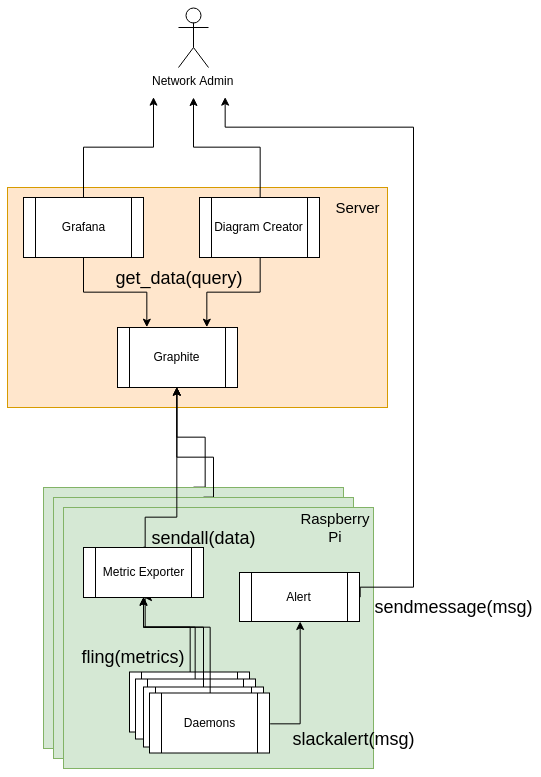
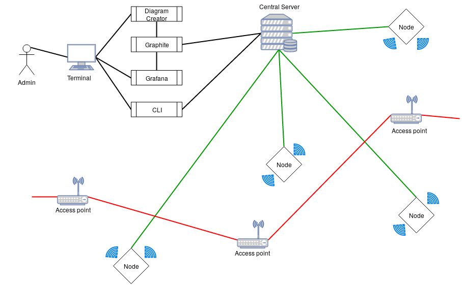

# Panoptes Technical Manual

## 0. Contents

   1. Introduction
       1.1 Overview
       1.2 Glossary
   2. System Architecture
       2.1 Language Choice
   3. High-Level Design
       3.1 Inital Design
       3.2 Current Design
   4. Problems and Resolution
   5. Installation Guide
   6. Configuration 
   7. Testing
       7.1 Functional Testing
       7.2 Non Functional Testing 
   8. Class Skeletons

## 1. Introduction

> Almost all businesses nowadays from small to huge provide wifi across their grounds and a lot of this goes over looked in terms of reliability and security. While in some settings the users may be trusted, others like coffee shops users are not trusted. We propose to build a solution that will collect metrics about the performance on a network, identify problems under loads, graph the metrics to see trends, create dynamic diagrams of the network and also detect and alert to malicious activity that may be occuring on the network. 

#### 1.1 Overview

> This project is setting out to be able to monitor wifi networks across and organisation, from small scale like a coffee shop, to large scale in a college campus. We want the nodes to be relitivly cheap and also work well on a large, distributed scale. We want them all independent and to be able to work regardless of communication with other nodes.
> A lot of attacks can be performed on wifi networks and we hope to add intrustion detection in our system to alert to such attacks. We also want to collect statistics on the wifi network to alert administrators of the network to poor performance, outages and black spots. Overall we want to improve the monitoring and the statisitcs we get back from wifi.



#### 1.2 Glossary

> * Kali Linux : Linux with prebuilt tools for low level networking and penetration testing. [Source](https://www.kali.org/)
> * Raspberry pi: Small form factor and reasonably priced computer that provides stealth and portability of the system [Source](https://www.raspberrypi.org/)
> * Pickle: What pickle does is that it “serialises” the object first before writing it to file. Pickling is a way to convert a python object into a character stream. [Source](https://pythontips.com/2013/08/02/what-is-pickle-in-python/)

## 2. System Architecture

> The system will run on a raspberry pi 3, cheap and small form factor computer. They have a wireless card build in but this is not capable of monitor mode. This is only to send metrics out on. It is also equiped with and ethernet port that can also be used to send metrics out on possibly more reliably.
> We also need an interface in managed mode to pass metrics about the device back to the server. For this reason we are using a Alfa networking card with a Ralink Technology, Corp. RT2870/RT3070 chipset and the driver on that chip at the time of development is rt2800usb. For outages and doggy wifi zones the ethernet port on the raspberry pi can be used and will failover in the event of wifi going down. This can also be configured as the primary way to send metrics.
> Because what we are doing is detering hackers, we must employ the use of tools the hackers use. So we are using a linux distrbution for the raspberry pi operating system called kali (previously known as backtrack).
> The primary power source for this device will be 5 volts from a wall outlet but because this is a low voltage computer we can easily use a battery pack to power the device.

#### Diagram



#### 2.1 Language Choice

> Python is a very easy to read language with many nice features including the scapy library
> Python 2 is being depricated in 2020 so we felt this was not an option, even though it has a better track record with working with byte strings
> Python 3.6 has new features such as f-strings that would clean up our code, it has much improved on it's handling of byte strings and it has over come it's speed problem to pass out python 2.7 in speed.
> For the reasons mentioned above pyton 3.6.4 was the winner and what was decided to develop the project in.
> This is by far the ideal language and run time is affected by this choice. But when we look at the timeframe of the project we would not have the features we have today in as little a time with any other language. 

## 3. High-Level Design

### 3.1 Inital Design
> The high-level design of this project is a small amount of python software (this project) running on kali linux on a raspberry pi. This software will collect metrics about the network and alert us to any malisious activity on the network. 
> One wireless card will be enabled for sniffing packets from the air in monitor mode
> There is another built-in wireless card for sending metrics
> There is also an ethernet port for more reliable sending of metrics

> In software design we have decided that with python's concurency problems we will be running each plugin as a daemon. This will allow the operating system to manage all the resource handling.
> There will be a central config to tune each of the plugins so that they can be run more or less often, depends one what the end user cares about.
> The daemons will all be stoped, started and handled by a main python file.
> This will automatically import all the modules in the sub diectory
> Once it has them imported it can stop, start and manage them

> Metrics will be sent to a time series database called graphite at a remote or local location. This will then be queried by grafana and our own diagram creator, to create visuals of the data.
> This will be send by udp packets with an exporter that we will write ourseves.
> This is how the end user will interact with the data
> They can also configure alerts easily with an alert module. Slack notifications are working currently.
> Grafana will also issue alerts on graphs to a range of channels.

### 3.2 Current Design
 > Following some problems encountered along the way we have had to change the design slightly. 
 > We had a problem that python could not stat all the daemons and would get muddled up in itself, it being a high level language.
 > We could not get over this hudle fast enough and it was decided to fail fast on this issue and push it to be fixed in a later release.
 > In stead we wrote a bash script that would start each of the files.
 
 > The other issue we had with our design was udp metrics not showing up in graphite. This was another issue that took days away from more pressing matters. 
 > In the end it was decied that if metrics were making it to graphite with tcp we would go with that and push udp metrics to a later release. 
 > Another design idea would be to bulk send the metrics and send them with tcp. This is how big industry does it e.g Amazon
 > But we also wanted fast metrics, so some plugins micro batch and other just use tcp to send a metric at a time. 
 > As of right now they are not pickeled either. That will be in a later release that that feature would be implemented
 
 > Other than these our original design has remained untouched. There are a few more problems we encountered, these are in the next section.

## 4. Problems and Resolution

> * Metrics when sent with UDP to graphite do not show up in graphite but they do with TCP. This is still to be investigated further but the resoution is to use tcp for sending metrics. To optimise this workaround we plan to send metrics as a batch pickeled to avoid congesting wifi traffic with the monitoring system.

> * When testing metric fling we are trying to send a metric and also catch that metric going across the wire to the server. To do this we have had to create a work around where a thread sends metric on a loop and scapy will sniff and stop on the first one that matches a filter of what that metric should look like. More checks are then done on that packet, i.e. destination port. While this testing method is not ideal we are confident it the capablility of it catching most errors

> * While attempting to test the restart method for daemons the daemon will fork away from unittest causing errors. It is not known how this will be tested or it will be a redesign of how the restart method is implemented but it is a known defect.

> * With the panoptes.py file, we could not get all the daemons to be started at once. The main method would only start one at a time, therefore we came up with a bash solution, this is definatly not ideal but it works for now. It does not do automatic importing like the python script did but we feel this is a minor set back. With more time we feel we could maybe figure something tidier out but currently time is a lugsury we do not have. We believe the cause to be again the case that when we call the daemon file it forks itself away from the python process and the python proccess then ends. We are not 100% sure on this however and would like to revisit at a later date.

> * While trying to have automatic deployment from our repo (i.e every time there is a merge to master and tests pass we deploy to all raspberry pis) we found difficulty doing this. For one the raspberry pis do not have static ips. This means that we do not know, or want hard coded in what each of their addresses are to send the updates. This means we have to come to a compramise. We will have the pi's go to the repo an d fetch it every few minutes, configurable in the config. This does not come without it's own set of problems though, one of such is each pi will need authorised ssh keys to the repo if we want to git pull. There may be a better solution to this again, but we have a lot of issues and this solution of maualy sshing to the pi and updateing will work temporaraly.

> * Currently because of hardware, we only monitor one band at 2.4mhz. This is because our antenna can only scan 2.4mhz. And we can only set our interface to listen on one band of this range too. We could hop between all the bands, and we tried this, but it causes us to miss a lot of the packets as we found that most of the packets occur on channel 6 while we are looking trying to get all the packets, we are missing a lot. That is why we decided that we only sniff channel 6. This is configurable though, if you happen to be in a location that uses another channel dominantly.

## 5. Installation Guide

### Dependencies

* Python **3.6** or higher
* Pip3 for installing requirements in requirements.txt

> * This system was designed with kali linux in mind and therefore to run as root. If you install all packages needed and run as root it should work.

### How to install

#### Installing the OS

We need to install the software on an sd card to boot the raspberry pi from.

First we need to download the kali linux image from [kali website](https://www.offensive-security.com/kali-linux-arm-images/#1493408272250-e17e9049-9ce8)

Or with the following command 

```bash
$ wget https://images.offensive-security.com/arm-images/kali-linux-2018.1a-rpi3-nexmon.img.xz
```

> **Remember** : Never download Kali Linux images from anywhere other than the official sources, and you should go [here](https://docs.kali.org/kali-on-arm/install-kali-linux-arm-raspberry-pi) to see how to verify your image 

Once we have our image we want to write it to and sd card. Insert the sd card into your machine and type

```bash
$ sudo fdisk -l
```

Find the disk that is your sd card (should be something like /dev/sdb, but may not) 

> **Warning** Make sure this is not your harddrive and is your sd card, everything will be overwritten

When you have found your card you can write the image to the card with the following command

```bash
$ sudo dd if=PATH of=DEST bs=512k
```

where PATH will be the path to where you downloaded the fie to
and DEST will be the path to your sd card we found earlier, e.g. /dev/sdb

Now you can remove your sd card pop it in your pi and boot it up. We are gonna need a monitor keyboard and mouse for this next bit

#### Installing the Software on the OS

```bash
$ git clone https://gitlab.computing.dcu.ie/doylet9/2018-CA326-tdoyle-distributedwifimonitoring.git
$ cd 2018-CA326-tdoyle-distributedwifimonitoring/code/
$ chmod +x install.sh
$ ./install.sh
```

## 6. Configuration

#### Example Config

```json
{
    "slack": {
        "slack_token": "Insert slack token",
        "slack_channel": "#random",
        "slack_emoji": ":robot_face:",
        "slack_username": "Panoptes Alerts"},
    "ap_metrics":{
        "sleeptime" : 1,
        "interface" : "mon1",
        "pktcount" : 500},
    "nodeup" : {
        "sleeptime" : 2},
    "system_stats" : {
        "errorlog" : "/var/log/panoptes/system.log",
        "sleeptime" : 2},
    "ssid_detection" : {
        "interface": "mon1",
        "errorlog" : "/var/log/panoptes/system.log",
        "known_ssids" : "/etc/panoptes/known_ssids.txt"},
    "ping_metrics" : {
        "sleeptime" : 1},
    "packet_stats": {
        "timeout" : 1,
        "interface": "mon1"},
    "pushbullet": {
        "push_device_tokens": ["insert api tokens"]},
    "dhcp_rogue_server": {
        "interface": "mon1",
        "sleeptime": 2},
    "arp_Test": {
        "interface": "mon1",
        "sleeptime": 1,
        "maclimit": 2}
}
```

##### slack

This specifies settings for slack messages (used for alerts)
> **slack_token**: An api key for your slack channel.
> **slack_channel**: What slack channel do you want you alerts to go to.
> **slack_emojii**: What emoji will be the character for your slack messenger
> **slack_username**: Username of the message sender

##### ap_metrics

This specifies settings for ap_metrics plugin
> **sleeptime**: How often the plugin will run (Seconds)
> **interface**: What interface will the pllugin use to sniff
> **pktcount**: How many packets will the plugin sniff before analysing

##### nodeup

This specifies settings for node up, a phone home plugin
> **sleeptime**: How often plugin runs i.e. How often it reports home (Seconds)

##### system_stats

This specifies setting for collecting metrics about the nodes load
> **errorlog**: Where the error log will write to
> **sleeptime**: How often the pluigin runs (Seconds)

##### ssid_detection

This specifies settings for ssid detection plugin
> **interface**: What interface should we sniff on
> **errorlog**: Where to write errors to
> **known_ssids**: Where to read from for known ssids

##### ping_metrics

This specifies settings for ping metrics plugin
> **sleeptime**: How often to run plugin (Seconds)

## 7. Testing

### 6.1 Functional 

> For testing we attempted to use a continuous integration model. This did not work out as expected because of difficulties getting a deploy to run. If we were to continue the project further we would add a deploy option to our setup.
> The setup does contian unittest for most of our code basee. This is run each time we commit in our gitlab-ci. 
> The container we chose to use is the kali-linux image from docker hub. We chose this image because it was very close to the image that we are running on the raspberry pi, and for testing we wanted it to be as close as possible to the real case. 
> We didn't run tests for some functions because it depended on physical hardware that we couldn't figure out in the amount of time alloted how to emulate.
> These plugins were tested by hand ad-hoc instead. 
> To improve the reproducibility we should have written a script to run locally, but this was put on the back burner in favour of testing by hand, somewhat foolishly.

Testing Highlights
> To test the plugin metric_fling, we first start a thread of sending packets with metric fling. This tries to catch packets leaving the container to see if the plugin works. This is not exactly right because of the delay we send multiple packets to increase the probability that we catch the packets.
> To test the plugin ssid_detection, we started our raspberry pi and had it finding beacon packets from access points and then turned on a hotspot. This hot spot was a "protected name" (i.e. one we didn't want anyone else to have on our network) and saw if the ssid_detection send us an alert. This was not tested in the gitlab-ci because of hardware that was needed to run the test and the heavy human element of starting a hotspot physicaly near by.
> To test the diagram drawer it was a very visual task. The aim of the diagram drawer was to draw graphs with a small amount of nodes to a large amount of nodes and create a graph that was visualy apealing with both. This task had to be performed by a human. We also used mock data for the testing because we didn't have enough nodes to put it through the paces.

### 6.2 Non Functional

#### Speed
> Speed we definded as "fast enough for the metrics to be relevent". We believe that was have definatly done just that. After booting the raspberry pi within a few seconds metrics are displayed let alone recieved by the the database. One performance hit we are aware of is the fact that our metrics are sent with a tcp packet and not a udp packet.
> We also tested our system running at multiple different speeds to see how much traffic it would generate compared to the traffic already experienced by the network. The impact was minimal as intended. 

#### Accuracy
> Accuracy of the data collected had to correct. If the metrics were in accurate then the project would be a failour. We have found that these metrics arrive fast and are accurate. They were mesured by comparing system stats locally and in the graph and both were displaying the same data with minimal delay.

#### Ease of use
> This can be a bias metric, but we believe that the system is easy to use to a technical audience, which is the audience we were aiming for. At the begining we had no shutdown function and often the pi's filesystem became corrupted. Having to reinstall everything meant that we scripted and documented it, multiple times leaving the setup process quite moderate. 
> All the plugins can be configured with the main config, and can be easily changed and changed back again.
> Once configured the system will start again from boot. Therefore if there is a powercut or anything goes wrong, pi's can be turned off and on again and they can run once more.

### Class Skeletons

#### Daemon.py

```python
class Daemon:
    '''
        Daemon class to be subclasses by all other daemons
        Based on Sanser Marechal\'s \"Simple linux daemon in python2\"
    '''
    def __init__(self, pidf):
        pass

    def daemonise(self):
        """ 
        Create daemon form proccess

        Fork twice to stop zombie processes 
        Stackoverflow 881388

        :raises OSError: Fork failed
        """

    def delpid(self):
        """
        Delete pid file
        """

    def start(self):
        """
        Start the deamon
        Open the pid file and if something in there then already running

        :raises IOError: If there is no pid
        """

    def stop(self):
        """
        Stop the daemon

        :raises IOError: If there is no pid
        :raises OSError: If there is no process to kill
        """

    def restart(self):
        """
        Restart daemon

        :raises *: Everything start and stop would raise
        """

    def run(self):
        """
        Other daemons override
        """
        pass

```

#### Metric_fling.py

```python
class Metric_Fling():
    '''
        Class to follow a log file and send metrics to graphite server
    '''
    def __init__(self, carbon_server,carbon_port):
        pass

    def fling(self, message):
        """
        Takes a metric string and sends it to graphite server with UDP

        :message: string metric to be sent to graphite server
        """

    def pickle_fling(self, data):
        """
        Take a metric list of strings and pickles them before 
        sending to graphite server with TCP

        :data: a list of strings to be pickled and sent
        """

    def tcp_fling(self, data):
        """
        take a metric string and send it ro graphite server with TCP

        :data: strings to be sent to grapite server
        """
```

#### Nodes_up.py

```python
class Nodes_Up(Daemon):
    '''
        Class to monitor nodes running
    '''
    def __init__(self, pidf):
        pass

    def read_config(self):
        """
        Reads a json config to set configuable variables
        """

    def run(self):
        """
        Starts the daemons
        """
```

#### Ap_metrics.py

```python
class Ap_Metrics(Daemon):
    '''
        Class to collect metrics on access points
    '''
    def __init__(self, pidf):
        pass

    def read_config(self):
        """
        Reads in json config files and sets configurable variables
        """

    def is_ap(self, pkt):
        """
        Checks to see if a packet came from an access point

        :pkt: Packet sniffed by scapy
        """

    def find_ap(self):
        """
        Sniff packets comming in to find access point broadcast packets
        """

    def run(self):
        """
        Runs command and controls execution
        """
```
#### packet_stats.py

```python
class Packet_Stats(Daemon):
    '''
        Class to collect stats about packets
    '''
    def __init__(self, pidf):
        pass

    def read_config(self):
        """
        Reads in json config and sets configurable variables
        """

    def parse_metrics(self, tcp, udp, icmp, other):
        """
        Formats and send metrics to graphite server
        """

    def find_ap(self):
        """
        Sniffs packets to find beacon packets from access points
        """

    def run(self):
        """
        Runs the daemon and controls execution
        """
```

#### ping_metric.py

```python
class Ping_Metric(Daemon):
    '''
        Test latecy in network
    '''
    def __init__(self, pidf):
        pass

    def read_config(self):
        """
        Reads config from json files and sets configurable vaiables
        """
    
    def ping(self):
        """
        Requests ping from os and returns times
        """

    def run(self):
        """
        Runs the daemon and controls execution
        """
```

#### ssid_detection.py

```python
class Ssid_Detection(Daemon):
    '''
        Class to detect a reservered ssid comming from an unkown mac address
    '''
    def __init__(self, pidf):
        pass

    def read_config(self):
        """
        Reads in json config and sets configurable variables
        """

    def is_ap(self, pkt):
        """
        Checks if a packet is from an access point

        :pkt: Packet sniffed by scapy
        """

    def find_ap(self):
        """
        Sniffs packets to find beacon packets from access points
        """

    def read_ssid(self):
        """
        Reads in all known ssids from config

        :raises FileNotFoundError: The config file could not be read/found
        """

    def send_alert(self, message):
        """
        Send a slack alert to channel

        :message: String message to send as alert
        """

    def run(self):
        """
        Runs the daemon and controls execution
        """
```

#### system_stats.py

```python
class System_Stats(Daemon):
    '''
        Class to monitor system stats
    '''
    def __init__(self, pidf):
        pass

    def read_config(self):
        """
        Read in config values from json config to set configurable variables
        """

    def get_loadavg(self):
        """
        Reads /proc/loadavg file to find the systems load average 
        for 1min 5min 10min

        :raises OSError: file could not be read
        """

    def parse(self, data):
        """
        Formats data recived from file to graphite metric format

        :data: list of strings to be formatted
        """

    def run(self):
        """
        Runs the daemon controls funcitonality
        """
```
