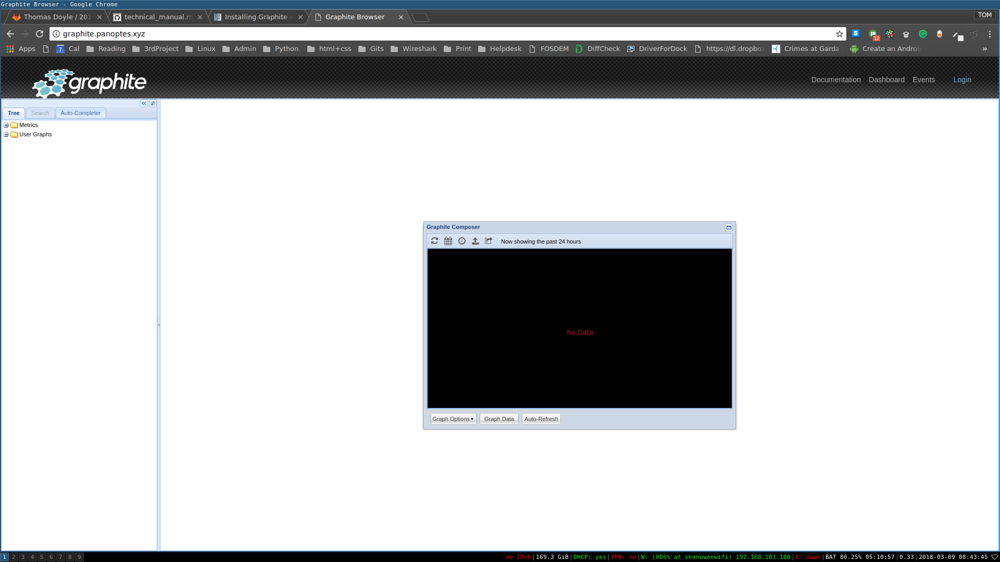
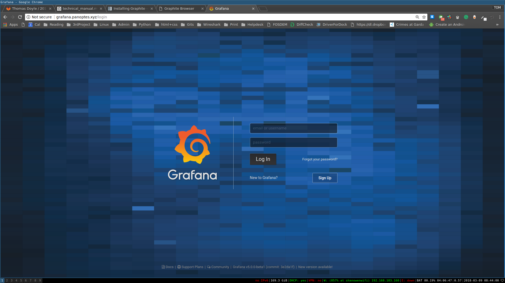
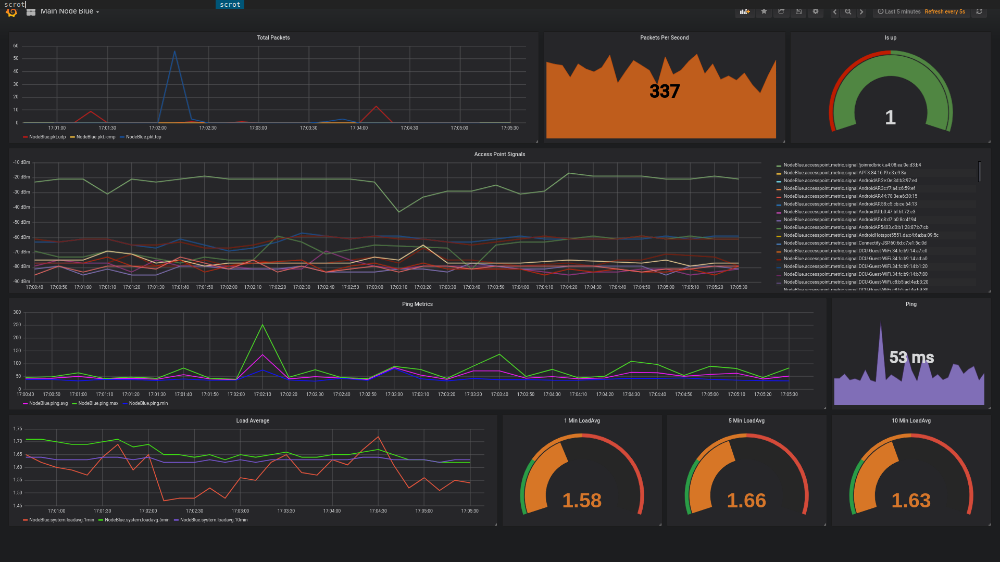
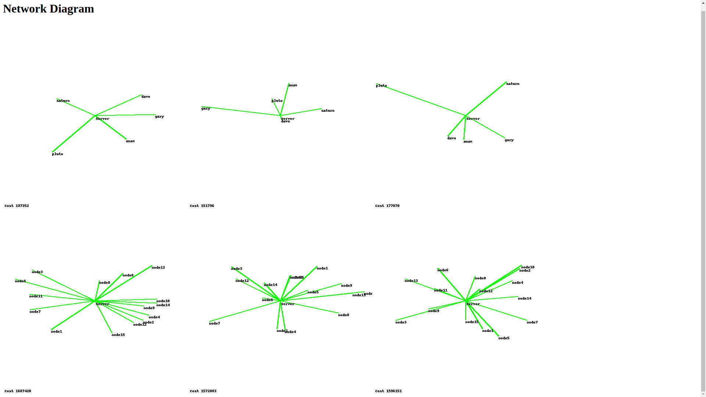

# Panoptes User Manual

## Contents

1. Dependencies
2. How to install
    - 2.1 Install OS
    - 2.1 Installing system
3. How to use
4. Configuration
5. Plugins Created
6. Help
7. Installing graphite
8. Installing grafana
9. Configuring Diagram Drawer

### Dependencies

* Python **3.6** or higher
* Pip3 for installing requirements in requirments.txt
* You can also see a list of required modules in requirments.txt

### How to install

#### Installing the OS

First we need to download the kali linux image from [kali website](https://www.offensive-security.com/kali-linux-arm-images/#1493408272250-e17e9049-9ce8)

Or with the following command 

```bash
$ wget https://images.offensive-security.com/arm-images/kali-linux-2018.1a-rpi3-nexmon.img.xz
```

> **Remember** : Never download Kali Linux images from anywhere other than the official sources, and you should go [here](https://docs.kali.org/kali-on-arm/install-kali-linux-arm-raspberry-pi) to see how to verify your image 

Once we have our image we want to write it to and sd card. Insert the sd card into your machine and type

```bash
$ sudo fdisk -l
```

Find the disk that is your sd card (should be something like /dev/sdb, but may not) 

> **Warning** Make sure this is not your harddrive and is your sd card, everything will be overwritten

When you have found your card you can write the image to the card with the following command

```bash
$ sudo dd if=PATH of=DEST bs=512k
```

where PATH will be the path to where you downloaded the fie to
and DEST will be the path to your sd card we found earlier, e.g. /dev/sdb

Now you can remove your sd card pop it in your pi and boot it up. We are gonna need a monitor keyboard and mouse for this next bit

#### Installing the Software on the OS

```bash
$ git clone https://gitlab.computing.dcu.ie/doylet9/2018-CA326-tdoyle-distributedwifimonitoring.git
$ cd 2018-CA326-tdoyle-distributedwifimonitoring/code/
$ chmod +x install.sh
$ ./install.sh
```

### How to use

* Once installed all the plugins will run on reboot. 
* If you do not want to reboot you can run them manualy by running the following options

```bash
$ ./start # To start all the plugins

$ ./stop  # To stop  all the plugins

$ ./start && ./stop # To restart all the plugins
``` 

> If you do not like, want or need a plugin just move it to another folder

```bash
$ mkdir bakupPlugins
$ mv pluings/example bakupPlugins/example
```

### Configuration

You can change many things about the project so that is runs to suit your needs. The following is an example config you can use to get your started.

> You should edit your config.json created after install not the config.example

> You can also edit you hostname in /etc/hostname so that each node has a unique name

#### Example Config

```json
{
    "slack": {
        "slack_token": "Insert slack token",
        "slack_channel": "#random",
        "slack_emoji": ":robot_face:",
        "slack_username": "Panoptes Alerts"},
    "ap_metrics":{
        "sleeptime" : 1,
        "interface" : "mon1",
        "pktcount" : 500},
    "nodeup" : {
        "sleeptime" : 2},
    "system_stats" : {
        "errorlog" : "/var/log/panoptes/system.log",
        "sleeptime" : 2},
    "ssid_detection" : {
        "interface": "mon1",
        "errorlog" : "/var/log/panoptes/system.log",
        "known_ssids" : "/etc/panoptes/known_ssids.txt"},
    "ping_metrics" : {
        "sleeptime" : 1},
    "packet_stats": {
        "timeout" : 1,
        "interface": "mon1"},
    "pushbullet": {
        "push_device_tokens": ["insert api tokens"]}
}
```
##### slack

This specifies settings for slack messages (used for alerts)
> **slack_token**: An api key for your slack channel.
> **slack_channel**: What slack channel do you want you alerts to go to.
> **slack_emojii**: What emoji will be the character for your slack messenger
> **slack_username**: Username of the message sender

##### ap_metrics

This specifies settings for ap_metrics plugin
> **sleeptime**: How often the plugin will run (Seconds)
> **interface**: What interface will the pllugin use to sniff
> **pktcount**: How many packets will the plugin sniff before analysing

##### nodeup

This specifies settings for node up, a phone home plugin
> **sleeptime**: How often plugin runs i.e. How often it reports home (Seconds)

##### system_stats

This specifies setting for collecting metrics about the nodes load
> **errorlog**: Where the error log will write to
> **sleeptime**: How often the pluigin runs (Seconds)

##### ssid_detection

This specifies settings for ssid detection plugin
> **interface**: What interface should we sniff on
> **errorlog**: Where to write errors to
> **known_ssids**: Where to read from for known ssids

##### ping_metrics

This specifies settings for ping metrics plugin
> **sleeptime**: How often to run plugin (Seconds)

##### pushbullet

This specifes setting for pushbullet alerts
> **push_device_tokens**: is a list of api keys for each device you want to alert, becuase there is no group functionality in pushbullet


### Plugins created

* [X] Ssid detection        - Detects ssids spoofing trusted ones
* [X] Metric fling          - Exports metrics to graphite database
* [X] Access Point Metrics  - Collects signal from surrounding access points
* [X] System Load Average   - Collects load average for nodes
* [X] Nodes Up              - Reports if a node is up
* [X] Ping Metrics          - Reports latency metrics

### Help 

You can find help with the help function

```bash
$ python3.6 panoptes.py -h
```

Find solved issues and create new issues on the [gitlab issues](https://gitlab.computing.dcu.ie/doylet9/2018-CA326-tdoyle-distributedwifimonitoring/issues) page for this project

### Installing Graphite

This guide does not cover installing graphite. Refer to this [guide](https://graphite.readthedocs.io/en/latest/install.html)

When you get it running graphite has a web interface. It should look like this:



Graphite is quite bare bones and not as pretty as alertitives for graphs. So we are also using grafana

### Installing Grafana

This guide does not cover installing grafanan. Refer to this [guide](http://docs.grafana.org/installation/)

When you are done you should be greated by this login page.



Then you can follow grafana's already great [guides](http://docs.grafana.org/guides/getting_started/) to get started.

When you have your graphs set up they could look something like this. 



### Setting up Diagram drawer

The diagram drawer is set up to put an index.html page in your /var/www/ directory in a subdirectory called diagrams.

They only configuration for this is to point your site at it, possibly using apache.



**Example Apache Config**

```apache
<IfModule mod_ssl.c>
<VirtualHost YOURIP:80>

        ServerName diagram.example.xyz
        ServerAdmin admin@example.xys
        DocumentRoot /var/www/diagrams/

        ErrorLog ${APACHE_LOG_DIR}/error.log
        CustomLog ${APACHE_LOG_DIR}/access.log combined


</VirtualHost>

<VirtualHost YOURIP:443>

        ServerName diagram.example.xyz
        ServerAdmin admin@example.xys
        DocumentRoot /var/www/diagrams/

        ErrorLog ${APACHE_LOG_DIR}/error.log
        CustomLog ${APACHE_LOG_DIR}/access.log combined

</VirtualHost>
</IfModule>

```
